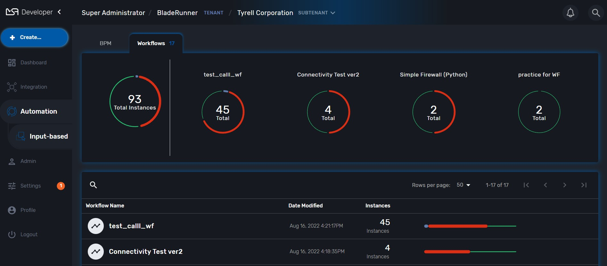
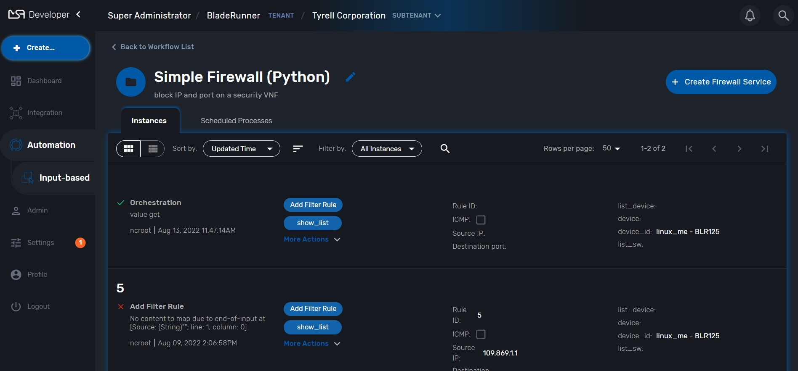
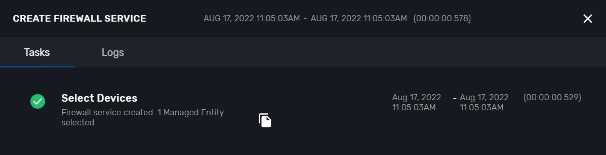

# WF Knowledge
This section describe knowledge of Workflow.  

---

## contents:

* [Before you debugging WF](#before-you-debugging-wf)
* [Debugging](#debugging)
* [Structure](#structure)

---
## Before you debugging WF
Make sure you selected in SUBTENANT

Click `SUBTENANT` MENU  

---
## Debugging
Chose `WF` you want to debugging  
If you don't have WF, please create the new one in [here](./sample.md).
Click `+ Create Firewall Service`

Fill example data and click in `Run`

Processes run successful

New Instances created

---
## Structure
WF has 3 parts:

1.Information

2.Variables

3.Processes

In Processes, we have 3 type Processes is `UPDATE`, `CREATE`, `DELETE`.

