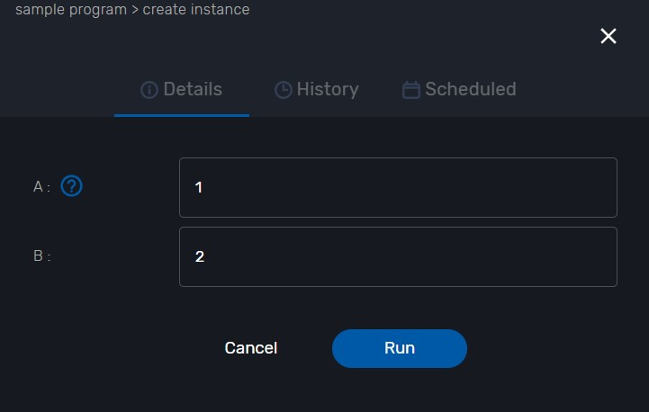
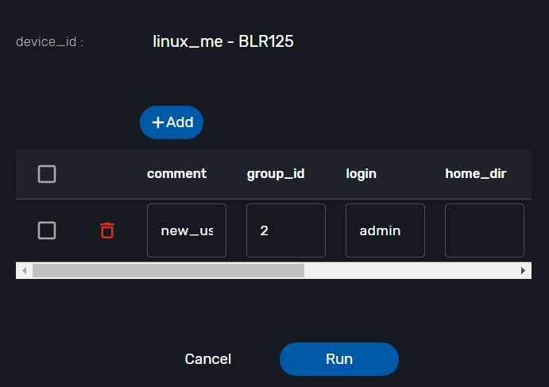
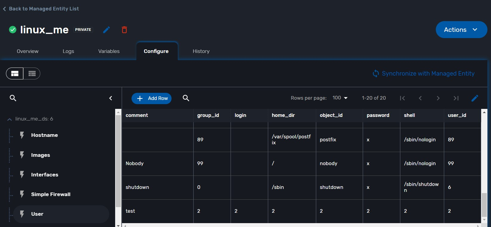

# WF Sample
This section describe sample sorce code of WF.  

---

## contents:

* [get some value from input menu in a task/not WF variables](#get-some-value-from-input-menu-in-a-tasknot-wf-variables)
* [pass variables from task_a to task_b](#pass-variables-from-taska-to-taskb)
* [create new user to linux ME](#create-new-user-to-linux-me)
* [get user list from linux ME and create selectable user list  (get user data inventory)](#get-user-list-from-linux-me-and-create-selectable-user-list-get-user-data-inventory)
* [get user from selectable user list](#get-user-from-selectable-user-list)
* [WF call to other WF](#wf-call-to-other-wf)

---
## Get some value from input menu in a task/not WF variables
For example, we get the input value menu. After that, print it went the task run successful.

Here is sample sorce code
```python
from msa_sdk.variables import Variables
from msa_sdk.msa_api import MSA_API

dev_var = Variables()
dev_var.add('A', var_type='Integer')
dev_var.add('B', var_type='Integer')

context = Variables.task_call(dev_var)
X = context['A']
Y = context['B']

Z = int(X) + int(Y)
context['C'] = Z

ret = MSA_API.process_content('ENDED', f'workflow initialized and ( X : {X}, Y: {Y})', context, True)
print(ret)
```
Debug the task:

Fill the input data 


Run the task (task name is `Task A`) the task will show the input Variables A and B


---
## Pass variables from task_a to task_b
In `task_A` we create the Variables name `C` and value is `A + B`.

Here is example code to show value `C`.
```python
from msa_sdk.variables import Variables
from msa_sdk.msa_api import MSA_API

context = Variables.task_call()
Z = context['C']

ret = MSA_API.process_content('ENDED', f'value get( C : {Z})', context, True)
print(ret)
```
Degub the task:

Here is result after user input 2 Variables`A`,`B` is `1` and `2`.

the `C`Variables is `A + B`


---
## Create new user to linux ME
Example code 
```python
import json
from msa_sdk.variables import Variables
from msa_sdk.msa_api import MSA_API
from msa_sdk.order import Order

# List all the parameters required by the task
dev_var = Variables()
dev_var.add('device_id', var_type='Device')
dev_var.add('user.0.comment', var_type='String')
dev_var.add('user.0.group_id', var_type='String')
dev_var.add('user.0.login', var_type='String')
dev_var.add('user.0.home_dir', var_type='String')
dev_var.add('user.0.object_id', var_type='String')
dev_var.add('user.0.password', var_type='String')
dev_var.add('user.0.shell', var_type='String')
dev_var.add('user.0.user_id', var_type='String')


context = Variables.task_call(dev_var)

# read the ID of the selected managed entity
device_id = context['device_id']

# extract the database ID
devicelongid = device_id[3:]

# build the Microservice JSON params
object_parameters = {}

object_parameters['user'] = {}
for v in context['user']:
  object_parameters['user'][v['object_id']] = v


# call the CREATE for the specified MS for each device
order = Order(devicelongid)
order.command_execute('CREATE', object_parameters)

# convert dict object into json
content = json.loads(order.content)

# check if the response is OK
if order.response.ok:
    ret = MSA_API.process_content('ENDED',
                                  f'STATUS: {content["status"]}, \
                                    MESSAGE: successfull',
                                  context, True)
else:
    ret = MSA_API.process_content('FAILED',
                                  f'Import failed \
                                  - {order.content}',
                                  context, True)

print(ret)
```
Debug the task:

Chose the ME you want to create user


Input the user profile

Then, click the run button


The new user create sussessful in ME



---
## Get user list from linux ME and create selectable user list  (get user data inventory)
Example code

```python
import json
from msa_sdk.variables import Variables
from msa_sdk.msa_api import MSA_API
from msa_sdk.order import Order

# List all the parameters required by the task
dev_var = Variables()

dev_var.add('device_id', var_type='Device')
# dev_var.add('drop')
context = Variables.task_call(dev_var)

# read the ID of the selected managed entity
device_id = context['device_id']

# extract the database ID
devicelongid = device_id[3:]

# build the Microservice JSON params

object_parameters = {}
object_parameters['user'] = '0';

# call the CREATE for the specified MS for each device
order = Order(devicelongid)
order.command_execute('IMPORT', object_parameters)

# convert dict object into json
content = json.loads(order.content)
hi = []
for i in json.loads(content['message'])['user']:
	h = {"user_id" : json.loads(content['message'])['user'][''+str(i)+'']['user_id'],
		 "password" : json.loads(content['message'])['user'][''+str(i)+'']['password'],
		 "object_id" : i
	}
	hi.append(h)
	
context['list'] = hi
# check if the response is OK

if order.response.ok:
    ret = MSA_API.process_content('ENDED',
                                  f'STATUS: {content["status"]}, \
                                    MESSAGE: successfull',
                                  context, True)
else:
    ret = MSA_API.process_content('FAILED',
                                  f'Import failed \
                                  - {order.content}',
                                  context, True)

print(ret)


```
Debug the task


---
## get user from selectable user list

---
## WF call to other WF
Describe: One WF calls to another WF has the task of ping to IP address

Example code WF ping IP address
```python
from msa_sdk.variables import Variables
from msa_sdk.msa_api import MSA_API
from msa_sdk.device import Device
from msa_sdk import util
import json


dev_var = Variables()
dev_var.add('addresses.0.ip')
# dev_var.add('addresses.0.status')
context = Variables.task_call(dev_var)

# get the current process id, useful for logging message to the process log file
process_id = context['SERVICEINSTANCEID']

# create a new variable Device to use the sdk function msa_sdk/device.html#msa_sdk.device.Device.ping
device = Device()

# get the list of IP addresses registered in the UI
# context['addresses'] contains the values entered for the array of variables "addresses"
addresses = context['addresses']

# for each IP addresses
i=0
for address in addresses:
	ip = address['ip']

  # call the ping function with the IP
  # the ping function will call a function implemented in the CoreEngine: the ping will be done from the container msa_sms
	ping_result = device.ping(ip)

  # log the result in the log file process-xx.log
	util.log_to_process_file(process_id, ping_result)

  # get the JSON result as a Python object
	ping_result_json = json.loads(ping_result)

  # update the addresses with the ping status
	num = len(context['addresses'])
	context['addresses'][i] = {}
	context['addresses'][i]['ip'] = ip
	try:
		context['addresses'][i]['status'] = ping_result_json['status']
	except:
		context['addresses'][i]['status'] = 'not working'
	i += 1

if context['addresses'][0]['status'] == 'OK':
	# prepare the exit status of the task
	ret = MSA_API.process_content('ENDED', 'IP addresses {} is {}'.format(context['addresses'][0]['ip'],context['addresses'][0]['status']), context, True)
else:
	ret = MSA_API.process_content('ENDED', 'IP addresses {} is {}'.format(context['addresses'][0]['ip'], context['addresses'][0]['status']), context, True)
print(ret)

```
Debug the task:

Input IP address


Run the task and see some information.


Attention to important information:

UBIQUBEID: BLRA6  ~ It means the id of the subtenant

PROCESSINSTANCEID: 402

Done running a WF instance

----------------

Example code WF call WF instance:

get some info from the previous WF:


SERVICE_NAME : Process/workflows/Ping_IP/Ping_IP

PROCESS_NAME : Process/workflows/Ping_IP/Create

subtenant_inventory_id : BLRA6

process_id : 402


```python

from msa_sdk.variables import Variables
from msa_sdk.msa_api import MSA_API
from msa_sdk.orchestration import Orchestration
import re 
import json
import time
from msa_sdk import constants

dev_var = Variables()
dev_var.add('subtenant_inventory_id')
dev_var.add('SERVICE_NAME')
dev_var.add('PROCESS_NAME')
dev_var.add('process_id')

context = Variables.task_call(dev_var)


def get_process_instance(orch,process_id,timeout=600, interval=5):
 response = {}
 global_timeout = time.time() + timeout

 orch.get_process_instance(process_id)
 response = json.loads(orch.content)
 status = response.get('status').get('status')

 return response

ubiqube_id = context['subtenant_inventory_id']

# define class for call WF with same subtenant
orch = Orchestration(ubiqube_id)

orch.list_service_instances()
response_list_instance = json.loads(orch.content)
context['result_orch'] = response_list_instance
# context['sel_wf'] = 98

b=False
if len(response_list_instance) !=0:
	for list_instance in response_list_instance:
		# if int(list_instance['id'])==int(context['sel_wf'].get('instance_id')):
		if int(list_instance['id'])==98:
			b=True 
			break 

context['instance_found']=b

if context['instance_found']==False: 
	MSA_API.task_success('Instance not found (already deleted), skipping'. context, True) 

SERVICE_NAME = context['SERVICE_NAME']
PROCESS_NAME = context['PROCESS_NAME'] 
process_id = context['process_id']

responce=get_process_instance(orch,process_id)

context['result3'] = responce

# regex=r"New IP(.*)has"
# matches=re.search(regex.details)
# context['underlay_subnet_ip']=matches.group(1)

ret = MSA_API.process_content('ENDED', 'Task call wf is working', context, True)
print(ret)

```

Run process


We got information of the previous WF:

"details": "IP addresses 8.8.8.8 is OK"

Done.
